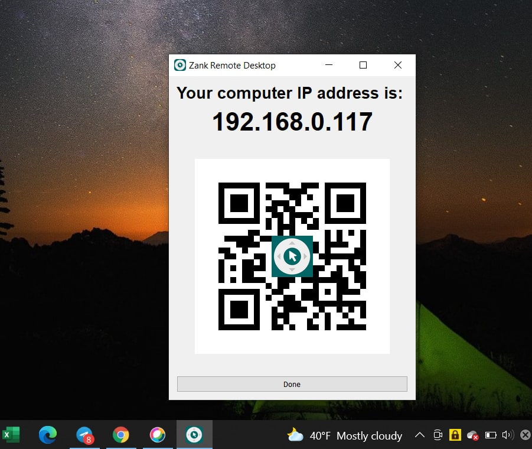

# Zank-Remote-for-Desktop (Beta)

## This is a beta version of Zank Remote application to control the computer mouse and keyboard on your Desktop

## How to install
### Desktop
You can manually customize other functions or features from the sources and then build the .exe file or download the exe file here, install it on your PC 

Open Zank Remote from System Tray => Click Show IP address 

### Mobile
Download Zank Remote for TV Box  app for your phone.
[Android](https://play.google.com/store/apps/details?id=zank.remote) or [iOS](https://apps.apple.com/us/app/zank-remote-for-smart-tvs-box/id1567602430))

In  order to remote your Desktop, **Allow** the application to connect to devices on local network.

Using QR code scanner or input your  Desktops’ IP address.

## Notes:
Your desktop and your phone need to be connected to the same LAN. The phone connects to the wireless network, the computer can connect to the wireless or wired network, as long as it is the same IP range.

Next plans:
- [ ] Speech Recognition
- [ ] Speech Command Features

Please contact me if you have any ideas on how to improve the applications!
